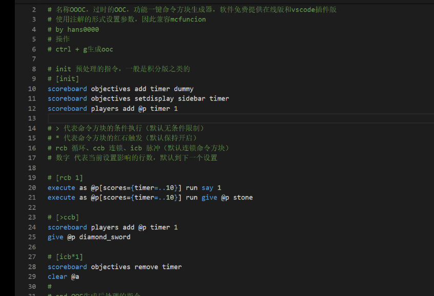
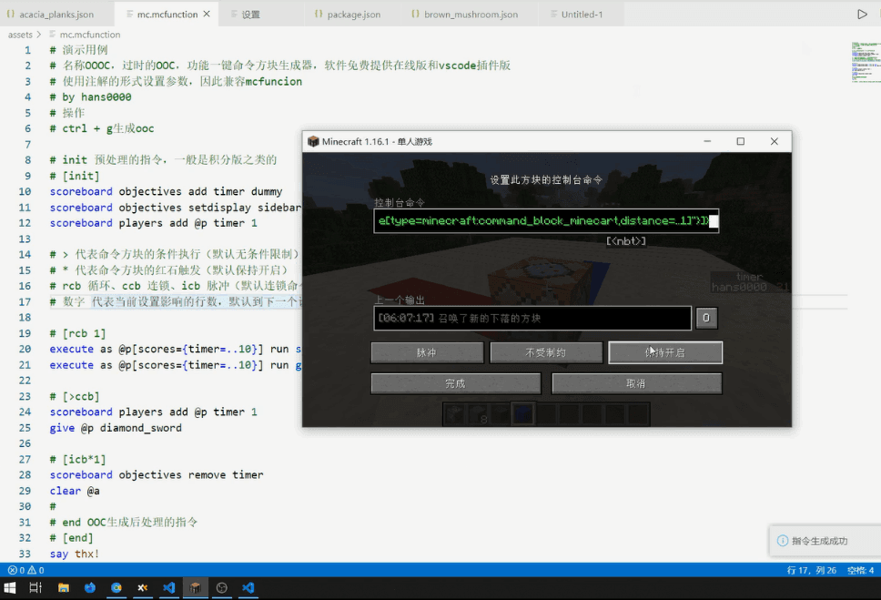

## 安装
- 链接：[oooc](https://marketplace.visualstudio.com/items?itemName=hans0000.obsolete-ooc)
- 直接在vscode插件面板搜索oooc

## 演示动图



## 操作
- 快捷键 ctrl+k ctrl+g
- ctrl+shift+p, 输入generate

## 代码补全
- init
- rcb
- ccb
- icb
- end

## 设置
- version 版本设置
- size 生成大小设置
- offset 偏移值设置

## hover提示
- 提醒用户注解设置含义

## 高亮
- 提醒用户注解设置影响的范围

``` 
# 演示用例
# 名称OOOC，过时的OOC，功能一键命令方块生成器，软件免费
# 使用注解的形式设置参数，因此兼容mcfuncion
# by hans0000
# ctrl + g生成ooc

# [config]
#
# 设置游戏版本，-version <版本号>（默认新版本）
# OOC共三个版本差异1.9-1.10 1.11-1.12 1.13-1.6
# -version 1.10

# 设置生成OOC的尺寸，-size <x> <z>
# -size 1 1

# -offset
# 设置生成OOC距离触发方块的偏移值，-offset <x> <y> <z>

# init 预处理的指令，一般是积分版之类的
# [init]
scoreboard objectives add timer dummy
scoreboard objectives setdisplay sidebar timer
scoreboard players add @p timer 1

# > 代表命令方块的条件执行（默认无条件限制）
# * 代表命令方块的红石触发（默认保持开启）
# rcb 循环、ccb 连锁、icb 脉冲（默认连锁命令方块）
# 数字 代表当前设置影响的行数，默认到下一个设置

# [rcb 1]
execute as @p[scores={timer=..10}] run say 1
execute as @p[scores={timer=..10}] run give @p stone

# [>ccb]
scoreboard players add @p timer 1
give @p diamond_sword

# [icb*1]
scoreboard objectives remove timer
clear @a
# 
# end OOC生成后处理的指令
# [end]
say thx!

# 软件还在开发阶段，如果有任何bug，请点击右上角的问题反馈

```